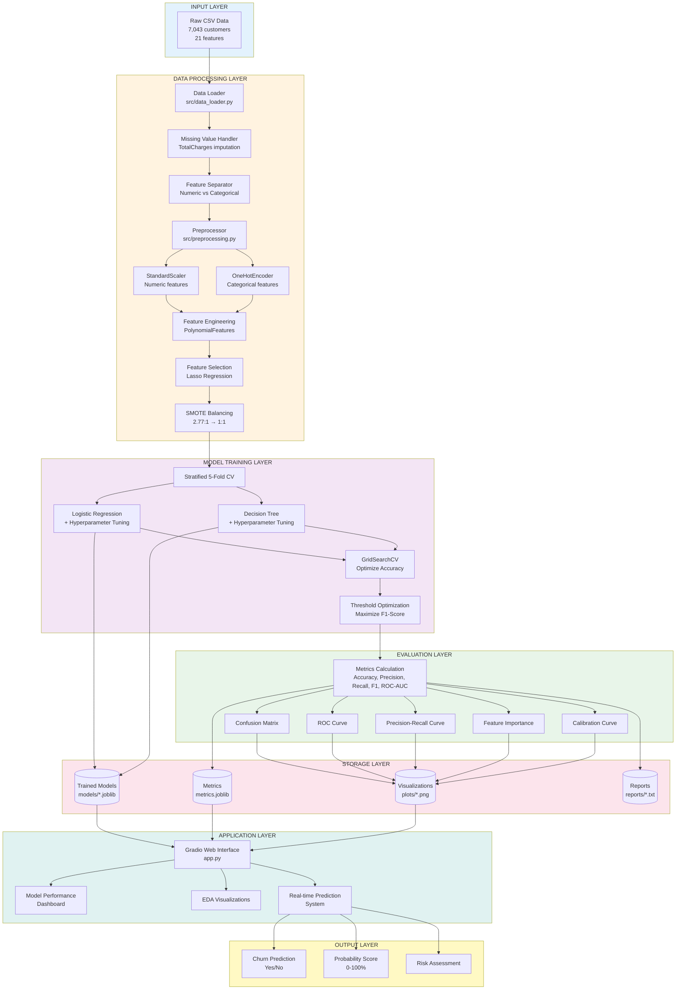

# Telecom Customer Churn Prediction System

## Overview

Production-grade ML system for predicting telecom customer churn using advanced preprocessing, feature engineering, and ensemble modeling with an interactive Gradio dashboard.

## System Architecture & Data Flow



## Detailed Pipeline Flow

### 1. Data Ingestion & Cleaning
```python
data_loader.py → load_and_clean_data()
├── Load CSV (7,043 rows × 21 columns)
├── Handle TotalCharges (11 missing → impute with MonthlyCharges)
├── Drop customerID (identifier)
└── Encode target: Churn (Yes=1, No=0)
```

### 2. Feature Preprocessing
```python
preprocessing.py → get_preprocessor()
├── Numeric Features (4): tenure, MonthlyCharges, TotalCharges, SeniorCitizen
│   └── StandardScaler (mean=0, std=1)
├── Categorical Features (15): gender, Contract, InternetService, etc.
│   └── OneHotEncoder (drop_first=True)
└── Output: 30 engineered features
```

### 3. Advanced Feature Engineering (Logistic Regression)
```python
train.py → Logistic Regression Pipeline
├── PolynomialFeatures (degree=2, interaction_only=True)
├── Lasso Feature Selection (max_features=30-50)
├── SMOTE (balance classes 2.77:1 → 1:1)
└── Logistic Regression (C=0.1-10, class_weight='balanced')
```

### 4. Model Training & Optimization
```python
train.py → GridSearchCV
├── Stratified 5-Fold Cross-Validation
├── Scoring: Accuracy (primary metric)
├── Hyperparameter Grid:
│   ├── Logistic Regression: C, penalty, max_features
│   └── Decision Tree: max_depth, min_samples_leaf, class_weight
└── Best Model Selection (highest CV accuracy)
```

### 5. Threshold Optimization
```python
train.py → get_optimal_threshold()
├── Generate probability predictions on test set
├── Compute Precision-Recall curve
├── Calculate F1-Score for each threshold
└── Select threshold maximizing F1-Score
```

### 6. Model Evaluation
```python
evaluation.py → get_evaluation_metrics()
├── Accuracy: Overall correctness
├── Precision: True positives / Predicted positives
├── Recall: True positives / Actual positives
├── F1-Score: Harmonic mean of Precision & Recall
└── ROC-AUC: Area under ROC curve
```

### 7. Visualization Generation
```python
evaluation.py → Plotting Functions
├── Confusion Matrix (TP, TN, FP, FN)
├── ROC Curve (TPR vs FPR)
├── Precision-Recall Curve
├── Feature Importance (Decision Tree)
├── Coefficients (Logistic Regression)
└── Calibration Curve (probability reliability)
```

### 8. Model Persistence
```python
joblib.dump()
├── models/logistic_regression_model.joblib
├── models/decision_tree_model.joblib
├── models/metrics.joblib
└── models/scaler.joblib (for inference)
```

### 9. Web Application Deployment
```python
app.py → Gradio Interface
├── Tab 1: Model Performance Dashboard
│   ├── Metrics table (Accuracy, Precision, Recall, F1)
│   ├── ROC & PR curves
│   └── Confusion matrices
├── Tab 2: Exploratory Data Analysis
│   ├── Distribution plots (tenure, charges)
│   └── Correlation matrix
└── Tab 3: Real-time Prediction System
    ├── Input: 19 customer features
    ├── Model selection (LR or DT)
    ├── Predict button
    └── Output: Churn label + Probability score
```

## Key Technical Decisions

| Component | Decision | Rationale |
|-----------|----------|----------|
| **Imbalance Handling** | SMOTE | 2.77:1 ratio requires synthetic oversampling |
| **Feature Scaling** | StandardScaler | Required for Logistic Regression convergence |
| **Encoding** | OneHotEncoder | Prevents ordinal assumptions in categorical data |
| **Feature Engineering** | PolynomialFeatures | Captures interaction effects (e.g., tenure × contract) |
| **Feature Selection** | Lasso (L1) | Reduces dimensionality, prevents overfitting |
| **CV Strategy** | Stratified 5-Fold | Maintains class distribution in each fold |
| **Threshold** | F1-Optimized | Balances precision and recall for business needs |
| **Calibration** | Sigmoid | Ensures probability scores reflect true likelihood |

## Project Structure

```
.
├── app.py                 # Gradio web interface (entry point)
├── train.py               # Training pipeline orchestrator
├── src/
│   ├── data_loader.py     # CSV loading & cleaning
│   ├── preprocessing.py   # ColumnTransformer setup
│   ├── models.py          # Model factory functions
│   ├── evaluation.py      # Metrics & visualization
│   └── eda.py             # Exploratory analysis
├── data/                  # Raw CSV dataset
├── models/                # Serialized models (.joblib)
├── plots/                 # Generated visualizations (.png)
├── reports/               # Analysis reports (.txt, .md)
└── requirements.txt       # Python dependencies
```

## Installation & Usage

### Setup
```bash
python -m venv venv
source venv/bin/activate  # Windows: venv\Scripts\activate
pip install -r requirements.txt
```

### Training
```bash
python train.py  # Trains models, generates plots, saves artifacts
```

### Launch Dashboard
```bash
python app.py  # Starts Gradio interface at http://127.0.0.1:7860
```

## Technologies

- **ML**: Scikit-Learn, Imbalanced-Learn, XGBoost
- **Data**: Pandas, NumPy
- **Visualization**: Matplotlib, Seaborn
- **Interface**: Gradio
- **Deployment**: Joblib (model serialization)
