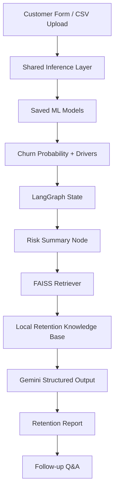

# Customer Churn Prediction & Agentic Retention Strategy

This project now covers both assignment milestones in one hosted Gradio application:

- **Milestone 1**: classical ML-based churn prediction with preprocessing, model comparison, EDA, single-customer scoring, and CSV batch scoring.
- **Milestone 2**: a LangGraph-based retention strategist that scores churn risk, retrieves retention best practices from a local knowledge base, and generates a structured intervention plan with follow-up Q&A.

## Hosted Workflow

The app is designed for Hugging Face Spaces with `python_version: "3.10"`.

- The app **does not retrain on startup**.
- Saved models are loaded from `models/`.
- Missing plots are regenerated from the saved models and dataset without retraining.
- The agent tab becomes active when `GEMINI_API_KEY` is configured in Hugging Face Space **Secrets**.

For Hugging Face Spaces:

1. Open the Space settings.
2. Add a secret named `GEMINI_API_KEY`.
3. Optionally add:
   - `RETENTION_MODEL=gemini-3-flash-preview`
   - `RETENTION_FALLBACK_MODEL=gemini-3.1-flash-lite-preview`
   - `RETRIEVER_TOP_K=4`

Do **not** hard-code API keys in the repository.

## System Architecture



## Milestone 1 Features

- Data cleaning for `TotalCharges`
- Standard scaling and categorical encoding with scikit-learn pipelines
- Logistic Regression and Decision Tree comparison
- Metrics: Accuracy, Precision, Recall, F1 Score, confusion matrices
- EDA visualizations
- Single-customer scoring
- CSV batch scoring with downloadable enriched output
- Driver summaries per prediction

### Required CSV Input Columns

```text
gender, SeniorCitizen, Partner, Dependents, tenure, PhoneService,
MultipleLines, InternetService, OnlineSecurity, OnlineBackup,
DeviceProtection, TechSupport, StreamingTV, StreamingMovies,
Contract, PaperlessBilling, PaymentMethod, MonthlyCharges, TotalCharges
```

## Milestone 2 Features

- LangGraph workflow with explicit typed state
- Local RAG using FAISS
- Telecom-focused retention playbooks stored in `knowledge_base/`
- Structured retention reports with:
  - business context
  - risk summary
  - key drivers
  - retrieved evidence
  - prioritized actions
  - next-touch plan
  - confidence notes
- Follow-up Q&A over the current customer case
- Graceful fallback when the Gemini secret is not configured

## Project Structure

```text
.
├── app.py
├── train.py
├── knowledge_base/
├── models/
├── src/
│   ├── inference.py
│   ├── runtime_assets.py
│   ├── evaluation.py
│   ├── preprocessing.py
│   ├── data_loader.py
│   └── agentic/
│       ├── graph.py
│       ├── retriever.py
│       ├── schemas.py
│       ├── state.py
│       └── prompts.py
└── tests/
```

## Local Development

Create a Python 3.10 environment for the closest match to the hosted runtime.

```bash
python3.10 -m venv .venv
source .venv/bin/activate
pip install -r requirements.txt
```

### Optional: Retrain Models Offline

```bash
python train.py
```

### Run the App

```bash
export GEMINI_API_KEY=your_key_here
python app.py
```

If `GEMINI_API_KEY` is not set, the ML tabs will still work and the agent tab will show a configuration error when used.

## Tests

```bash
pytest
```

Current tests cover:

- shared inference outputs
- batch scoring columns
- CSV validation
- agent configuration guardrails

## Model And Agent Defaults

- Default scoring model for agentic retention planning: **Logistic Regression**
- Agent generation model: `gemini-3-flash-preview`
- Fallback generation model: `gemini-3.1-flash-lite-preview`
- Embedding model: `gemini-embedding-001`
- Vector store: **FAISS**

## Notes

- `main.py` contains older exploratory experiments and is not part of the hosted app path.
- Generated vector indices are excluded from git and rebuilt locally when needed.
- Generated EDA summary files are excluded from git.
