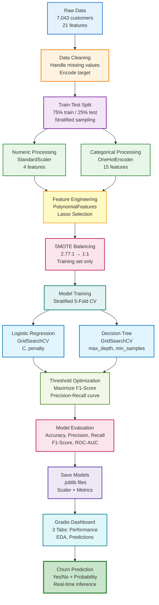

# Telecom Customer Churn Prediction System

Production ML system for predicting customer churn using Logistic Regression and Decision Trees with advanced feature engineering and SMOTE balancing.

## System Flow



## Pipeline Overview

### 1. Data Processing
- Load CSV dataset (7,043 customers, 21 features)
- Handle missing values in TotalCharges (11 records)
- Encode target variable: Churn (Yes=1, No=0)
- Split: 75% train, 25% test (stratified)

### 2. Feature Engineering
- **Numeric Features** (4): tenure, MonthlyCharges, TotalCharges, SeniorCitizen
  - Apply StandardScaler (mean=0, std=1)
- **Categorical Features** (15): gender, Contract, InternetService, etc.
  - Apply OneHotEncoder (drop_first=True)
- **Advanced** (Logistic Regression only):
  - PolynomialFeatures (degree=2, interactions)
  - Lasso feature selection (30-50 features)
- **Output**: 30 engineered features

### 3. Imbalance Handling
- Original ratio: 2.77:1 (No Churn : Churn)
- Apply SMOTE oversampling → 1:1 balanced training set
- Maintains test set distribution for realistic evaluation

### 4. Model Training
- **Stratified 5-Fold Cross-Validation**
- **GridSearchCV** for hyperparameter tuning
- **Models**:
  - **Logistic Regression**: C, penalty, max_features
  - **Decision Tree**: max_depth, min_samples_leaf, class_weight
- **Scoring**: Accuracy (primary metric)

### 5. Threshold Optimization
- Generate probability predictions on test set
- Compute Precision-Recall curve
- Select threshold maximizing F1-Score
- Balances precision and recall for business needs

### 6. Model Evaluation
- **Metrics**: Accuracy, Precision, Recall, F1-Score, ROC-AUC
- **Visualizations**: 
  - Confusion matrices
  - ROC curves (model comparison)
  - Precision-Recall curves
  - Feature importance (Decision Tree)
  - Coefficients (Logistic Regression)
  - Calibration curves

### 7. Deployment
- Save trained models (.joblib)
- Gradio web interface with 3 tabs:
  - **Performance Dashboard**: Metrics, ROC/PR curves, confusion matrices
  - **EDA**: Distribution plots, correlation matrix
  - **Prediction System**: Real-time churn prediction with probability scores

## Quick Start

```bash
# Setup
python -m venv venv
source venv/bin/activate  # Windows: venv\Scripts\activate
pip install -r requirements.txt

# Train models
python train.py

# Launch dashboard
python app.py  # http://127.0.0.1:7860
```

## Project Structure

```
├── app.py              # Gradio interface
├── train.py            # Training pipeline
├── src/
│   ├── data_loader.py     # Data loading & cleaning
│   ├── preprocessing.py   # Feature transformers
│   ├── models.py          # Model definitions
│   └── evaluation.py      # Metrics & plotting
├── data/               # CSV dataset
├── models/             # Trained models (.joblib)
└── plots/              # Visualizations
```

## Key Technical Decisions

| Component | Choice | Reason |
|-----------|--------|--------|
| **Imbalance** | SMOTE | Synthetic oversampling for 2.77:1 ratio |
| **Scaling** | StandardScaler | Required for Logistic Regression |
| **Encoding** | OneHotEncoder | Avoids ordinal assumptions |
| **Features** | PolynomialFeatures | Captures interactions (tenure × contract) |
| **Selection** | Lasso (L1) | Reduces overfitting |
| **CV** | Stratified 5-Fold | Maintains class distribution |
| **Threshold** | F1-Optimized | Balances precision/recall |

## Technologies

Scikit-Learn • Imbalanced-Learn • Pandas • Gradio
